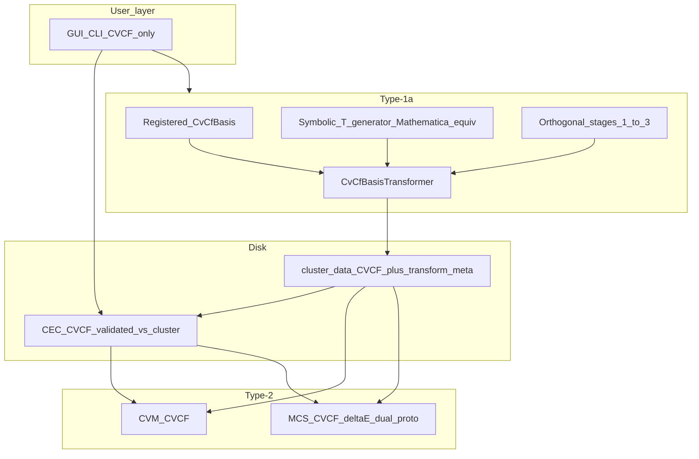

# CVCF basis pipelines: refined plan

## Product principles (user-facing layer)

- **CVCF is the top basis layer** for normal users: labels, tables, cluster data on disk, and CECs are presented and edited in **CVCF** terms only.
- **Orthogonal basis** remains an **internal implementation detail** of Type-1a Stage 3 (build orthogonal `cmat`, then apply `T`). It must **not** appear in the default GUI flows (no orthogonal tabs, no “ORTHO vs CVCF” toggles for routine work).
- **Expert access**: orthogonal intermediates (e.g. pre-transform c-matrix blocks, `cfBasisIndices`, or debug dumps) may remain available via an **explicit expert/debug** path only (CLI flag, hidden panel, or developer menu), not the primary workflow.

---

## Type-1a (cluster identification)

- **Compute**: Stages 1–2 and the first part of Stage 3 run in the **orthogonal** polynomial CF picture (existing `CMatrixBuilder` path).
- **Where `T` comes from (primary home for matrix generation)**  
Type-1a is the right stage to **generate or select** the ortho→CVCF transformation: it already produces the orthogonal `cmat` and immediately applies [CvCfBasisTransformer](app/src/main/java/org/ce/domain/cluster/cvcf/CvCfBasisTransformer.java). The user (or automation) chooses **how** `T` is supplied:
  - **Mode A — Registered / hand-coded**  
  Load `CvCfBasis` from code or registry (e.g. [BccA2TModelCvCfTransformations](app/src/main/java/org/ce/domain/cluster/cvcf/BccA2TModelCvCfTransformations.java)) when `T`/`Tinv` are reviewed and frozen.
  - **Mode B — Symbolic derivation (Mathematica-equivalent)**  
  **Generate `T`** from the same algebra as the reference notebooks: CVCF cluster variables as **expanded polynomials** in site operators `p[i][j]`, `pRules` / `substituteRules`, `CoefficientArrays` against orthogonal `uList`, linear solve / `Inverse` yielding `T` and `Tinv`, plus `uRandRules`-consistent metadata for random-state init.  
  **Example target**: **A1, ternary, tetra-approximation** — `tetrcvs` / `tricvs` / `paircvs` / `pointcvs`, `u2List` ordering, ~20 CVs as in your notebook.  
  Implementation may live in a **dedicated submodule** or external script that **outputs** a `CvCfBasis` consumed by the same `transform()` step — language is flexible if golden tests match Mathematica.
- **Persist (see [§ Disk footprint & I/O contracts](#disk-footprint--io-contracts-per-calculation-type))**: Write only what downstream consumers need, plus transform metadata; avoid duplicating identical dis/ord payloads and avoid serializing full geometry when a consumer does not need it.
- **Unsupported combinations**: If `(structure, model, numComponents)` has **no** registered `T` **and** symbolic Mode B is not implemented for that key, **Type-1a fails fast** with a clear list of supported keys and modes.

---

## Disk footprint & I/O contracts (per calculation type)

### Review: why `cluster_data.json` is huge today

- [AllClusterData](app/src/main/java/org/ce/domain/cluster/AllClusterData.java) serializes **five** large trees: `disorderedClusterResult`, `orderedClusterResult`, `disorderedCFResult`, `orderedCFResult`, `cMatrixResult`.
- Each [ClusterIdentificationResult](app/src/main/java/org/ce/domain/cluster/ClusterIdentificationResult.java) embeds full [ClusCoordListResult](app/src/main/java/org/ce/domain/cluster/ClusCoordListResult.java) data: **every cluster orbit with all site coordinates** (often tens of thousands of JSON lines). [ClusterIdentificationWorkflow](app/src/main/java/org/ce/workflow/ClusterIdentificationWorkflow.java) may use the **same** Java object for dis/ord slots, but **JSON serialization typically duplicates** the content twice.
- [CFIdentificationResult](app/src/main/java/org/ce/domain/cluster/CFIdentificationResult.java) carries another **full** decorated cluster / orbit description for CFs — again often duplicated dis/ord.
- **Necessary for thermo (CVCF CVM)**: Stage 1 **scalars and tables** actually used by [CVMPhaseModel](app/src/main/java/org/ce/domain/engine/cvm/CVMPhaseModel.java) — `tcdis`, `mhdis` (list), `kb`, `mh`, `lc` — plus Stage 3 **CVCF** `cmat`, `lcv`, `wcv`, and `cfBasisIndices` (for orthogonal random-init / expert tools). The **coordinate-heavy** cluster lists are **not** read by the CVM free-energy path.
- **Necessary for MCS**: [MCSEngine](app/src/main/java/org/ce/domain/engine/mcs/MCSEngine.java) uses `getDisorderedClusterResult().getDisClusterData()` — i.e. **HSP cluster topology / orbits** for embeddings, not the full duplicate ordered-phase tree unless a future MCS path needs it.

### Inputs / outputs summary

| Kind           | Inputs (what must be available)                                                                                                                                     | Outputs (what must be persisted or returned)                                                                                                                                                                                                                                                                                                 | Notes                                                                                                                  |
| -------------- | ------------------------------------------------------------------------------------------------------------------------------------------------------------------- | -------------------------------------------------------------------------------------------------------------------------------------------------------------------------------------------------------------------------------------------------------------------------------------------------------------------------------------------- | ---------------------------------------------------------------------------------------------------------------------- |
| **Type-1a**    | Maximal cluster files + symmetry files + transformation (ordered↔HSP) + `numComponents` + `T` source (registered/symbolic) + registry key (`structure`, model, `K`) | **CVCF** `cmat`, `lcv`, `wcv`; Stage 1 scalars: `tcdis`, `tc`, `mhdis`, `kb`, `lc`, `mh`, `nijTable` if needed for debugging; compact Stage 2 indices: `tcf`, `ncf`, `nxcf`, `lcf` (and name lists if required); `transformSource`, `transformId`, `clusterId`, `structurePhase`, model, `numComponents`; optional `cfBasisIndices` for init | **Do not** require full coordinate dumps for CVM-only runs. **Optional** full export for reproducibility.              |
| **Type-1b**    | Linked `cluster_id` + basis metadata; CVCF ECI terms (`e*` names)                                                                                                   | `hamiltonian.json` (or equivalent): elements, `structurePhase`, model, `cecTerms[]`, units, `ncf`, notes                                                                                                                                                                                                                                     | Small by design; validate against cluster metadata.                                                                    |
| **Type-2 CVM** | `AllClusterData` (minimal) + [CECEntry](app/src/main/java/org/ce/domain/hamiltonian/CECEntry.java) + composition + `T` + temperature                                | `EquilibriumState` (G, H, S, …); optional trace                                                                                                                                                                                                                                                                                              | **Read path** should load only **minimal** cluster snapshot if slim format exists.                                     |
| **Type-2 MCS** | `ClusCoordListResult` (topology) + `eci` + composition + lattice params                                                                                             | `EquilibriumState` / MC diagnostics                                                                                                                                                                                                                                                                                                          | Needs **geometry/orbits**; can be **separate file** referenced by hash (e.g. `topologyRef`) instead of inlining twice. |

### Policy: avoid unnecessary writes

1. **Single canonical phase**: If dis/ord cluster/CF results are identical, persist **once** (e.g. `sharedClusterResult` + flag, or omit redundant branch) — requires schema change or custom serializer.
2. **Tiered persistence**: **(A)** `cluster_min.json` — CVM thermo + metadata only; **(B)** `topology.json` (or pointer to original `clus/*.txt` + checksum) for MCS; **(C)** optional `cluster_full.json` or export for experts.
3. **Stage 2 slimming**: For CVM, engines only need **counts and `lcf`** (and basis for validation); drop serialized CF orbit geometry unless GUI/MCS requires it.
4. **Never duplicate** large arrays in JSON when a reference suffices (dedupe keys, `$ref`-style, or sidecar files).

### Implementation note

- Refactor [ClusterDataStore](app/src/main/java/org/ce/storage/ClusterDataStore.java) / domain DTOs to support **versioned** `cluster_data` schema (`schemaVersion`, `persistProfile`: `minimal`  `mcs`  `full`).
- Loaders upgrade or merge **minimal + topology sidecar** into a runtime `AllClusterData` (or split runtime types: `CvmClusterData` vs `McsClusterData`) so engines stay typed and testable.

---

## Type-1b (CEC / Hamiltonian preparation and storage)

- **Terminology**: “Type-1b” means **CEC authoring, validation, and on-disk storage** tied to a system (not the Monte Carlo runner itself).
- **Storage**: CEC JSON files store **CVCF CF names and coefficients only** (see [CVMEngine.evaluateECI](app/src/main/java/org/ce/domain/engine/cvm/CVMEngine.java)). No parallel “orthogonal CEC” product surface.
- **Relationship to `T`**: Type-1b **does not** build transformation matrices — it **assumes** a compatible **Type-1a** cluster dataset (or registry entry) already defines the basis. Workflows should **validate** that the CEC’s `(structure, model, K)` and optional `transformId` match the linked `cluster_data` (or fail fast). Optional: allow registering a **hand-coded** `CvCfBasis` for validation-only without re-running Type-1a, but symbolic **generation** remains a Type-1a concern.
- **Unsupported combinations**: Loading or saving a CEC when the referenced cluster/basis key is unsupported → **fail fast** (same messaging as Type-1a).

---

## Type-2 calculations

### CVM

- **CVCF only**: [CVMFreeEnergy](app/src/main/java/org/ce/domain/engine/cvm/CVMFreeEnergy.java) and [CVMPhaseModel](app/src/main/java/org/ce/domain/engine/cvm/CVMPhaseModel.java) already assume CVCF `cmat` and `buildFullCVCFVector`.
- **UI**: Remove or hide **legacy “ORTHO” CVM** mode from [CalculationPanel](app/src/main/java/org/ce/ui/gui/CalculationPanel.java) / [ThermodynamicRequest](app/src/main/java/org/ce/workflow/thermo/ThermodynamicRequest.java) for default users; keep only if wired as expert-only or delete after migration.

### MCS

- **Basis**: Monte Carlo continues to use **lattice topology** from cluster data; **energy model** for ΔE and reporting should be **CVCF-aligned** with the rest of the product (no user-facing orthogonal ECIs).
- **ΔE and enthalpy-related energy — design fork (choose explicitly)**:
**Option A — Transform sampled CFs to CVCF, then use CVCF ECIs**
  - During a move, evaluate or update **correlation functions in the same orthogonal indexing** that `T` expects, form vector `u_orth`, map `v = T^{-1} u_orth` (or accumulate Δ in CVCF space if linearity allows), then **H = Σ eci_k v_k** with **CVCF** `eci` from the CEC file.
  - Pros: Reuses existing `T`, same CEC files as CVM; single Hamiltonian definition.
  - Cons: Cost and correctness of maintaining consistent CF ordering vs `ClusterVariableEvaluator` / identification; must handle point CFs / composition consistently with CVCF convention.
  **Option B — Direct observables / CV-based probabilities**
  - Define energy from **cluster variables or configuration probabilities** directly observable on the lattice (e.g. NN pair counts → probabilities matching CVCF definitions), without an explicit full `u_orth` vector each step.
  - Pros: May match physical intuition (probability of A–B NN pairs) and avoid full vector transforms per move.
  - Cons: Must prove equivalence to the same CVCF Hamiltonian as CVM, or document as a **different** model; more implementation surface in [MCSEngine](app/src/main/java/org/ce/domain/engine/mcs/MCSEngine.java) / [MCSRunner](app/src/main/java/org/ce/domain/engine/mcs/MCSRunner.java).

**Plan approach (per product direction)**: **Implement both** Option A and Option B as prototypes behind a clear interface (e.g. `McsEnergyModel` or strategy enum), run on representative systems, compare correctness vs CVM reference and cost per sweep, then **drop the weaker path** and document the survivor. CVM/registry/CVCF-CEC work proceeds first so both MCS paths can share the same CEC files and basis metadata where applicable.

---

## Technical implementation (aligned with prior plan)

### 1. Single registry and keys

- Introduce **CvCfBasisRegistry** (or equivalent) keyed by `(structurePhase, modelId, numComponents)` — or `(structurePhase, numComponents)` if model is folded into structure naming. **Registered** entries may be hand-coded **or** produced by the Type-1a symbolic pipeline and then registered or exported (same runtime `CvCfBasis` shape).
- [CVMEngine](app/src/main/java/org/ce/domain/engine/cvm/CVMEngine.java), [Main.java](app/src/main/java/org/ce/ui/cli/Main.java), [ClusterIdentificationWorkflow](app/src/main/java/org/ce/workflow/ClusterIdentificationWorkflow.java), and CEC workflows **call this registry only**.
- **Query API**: e.g. `boolean isSupported(...)` for UI to disable or explain Type-1a / CEC actions.

### 2. Type-1a configuration

- Extend [ClusterIdentificationRequest](app/src/main/java/org/ce/workflow/ClusterIdentificationRequest.java) with: registry key fields (`structurePhase`, `numComponents`, **model** if needed), and `transformSource` (registered vs symbolic).
- Workflow: **if unsupported → throw** with actionable message.

### 3. Persisted metadata

- [AllClusterData](app/src/main/java/org/ce/domain/cluster/AllClusterData.java) (or companion blob): store **CVCF identity**, `transformSource`, `transformId` (or hash of `T`) — all written by **Type-1a** when cluster data is saved.
- **Type-1b** / CEC: reference the same keys so Type-2 can assert CEC ↔ cluster consistency.

### 4. Runtime validation

- After load: **cmat** column width vs `basis.totalCfs() + 1`; mismatch → error.

### 5. UI / expert split

- **Default**: CVCF-only CEC tables and cluster summaries; **Type-1a** run configuration exposes **how `T` is obtained** (registered vs symbolic), not raw orthogonal ECIs.
- **Expert**: optional debug view of orthogonal matrices / pre-transform dumps (read-only or export), gated; export of symbolic derivation trace for Mathematica parity.

### 6. Documentation

- User-facing: [TYPE_1A_DATAFLOW.md](TYPE_1A_DATAFLOW.md) — document **T source selection** on Type-1a and CVCF persistence; [CVM_DATAFLOW.md](CVM_DATAFLOW.md) — Type-2 consumes persisted basis; Type-1b = CVCF CEC only, aligned to cluster metadata.
- Expert: orthogonal math (`CMatrixBuilder`, `CvCfBasisTransformer`); **reference notebook parity** for symbolic `T` derivation (A1 ternary tetra example).
- MCS: document both ΔE prototypes and the retained approach after comparison.

### 7. Tests

- Registry: supported vs unsupported keys.
- Type-1a: unsupported key → expected failure.
- JSON round-trip with metadata (including `transformSource` / `transformId`).
- CVM integration: unchanged happy path for BCC_A2 + K=2,3,4.
- **Symbolic `T`**: golden tests against **exported Mathematica** `T`/`Tinv` for at least one full case (e.g. A1 ternary tetra-approximation, `u2List` / `cvs` as in your notebook).

---

## Architecture diagram (refined)

---

## Suggested order of work

1. **Registry** with `isSupported` + **guards** on Type-1a (including per-key symbolic Mode B) and Type-1b CEC validation against cluster metadata.
2. **Metadata** on cluster JSON (`transformSource`, `transformId`, …) + CEC cross-check + **validation** in CVM load path; **cluster I/O contract** — slim schema / dedupe / optional sidecar topology for MCS.
3. **UI**: hide orthogonal / ORTHO CVM from default; **Type-1a** control for **T source** (registered vs symbolic); expert debug for orthogonal artifacts.
4. **Type-1a**: symbolic **T** pipeline for first reference case (e.g. A1 ternary tetra) + **golden tests** vs Mathematica; registered path unchanged.
5. **Type-1b**: CVCF-only CEC surface; **no** separate T builder — validate vs Type-1a output.
6. **MCS ΔE**: prototype A and B; compare; remove one; document result.
7. **Docs** + **tests** for transform metadata and CVCF-only narratives.

This keeps [SIMPLIFIED_ARCHITECTURE.md](SIMPLIFIED_ARCHITECTURE.md) separation: domain math unchanged; **workflow + UI + storage** enforce the CVCF product layer and **fail closed** when transforms are missing.