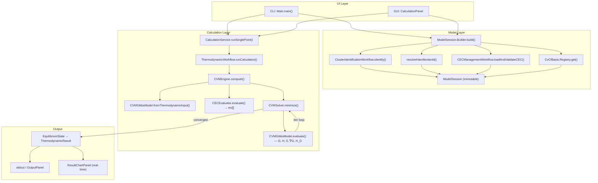

# CVM Calculation Pipeline: Detailed Data Flow & Execution Trace

This document traces the Cluster Variation Method (CVM) calculation pipeline as it runs in **CEWorkbench** after the three-layer architecture refactoring. It covers both entry points (CLI and GUI), then follows the shared pipeline through session building, engine dispatch, and Newton-Raphson minimisation.

---

## 1. Entry Points

### 1a. CLI Entry Point — `org.ce.ui.cli.Main`

The CLI supports five commands. The two that invoke the CVM engine are:

#### `calc_min` — single-point CVM with full minimisation
```
java -jar ceWorkbench.jar calc_min <elements> <structure> <model> <temp> <comp> [--verbose]
```
Execution path:
1. Parses `elements`, `structure`, `model`, `temp`, `composition` from `args[]`.
2. Creates `CEWorkbenchContext appCtx = new CEWorkbenchContext()`.
3. Builds a `ModelSession` **once**:
   ```java
   SystemId system = new SystemId(elements, structure, model);
   ModelSession session = appCtx.getSessionBuilder().build(system, EngineConfig.cvm(), sink);
   ```
4. Calls:
   ```java
   ThermodynamicResult result = service.runSinglePoint(session,
       new ThermodynamicRequest(temp, composition, sink));
   ```
5. Prints G, H, S to stdout.

#### `type2` — temperature line scan
```
java -jar ceWorkbench.jar type2 <elements> <structure> <model> [--verbose]
```
Execution path:
1. Parses system identity; sets `tStart=1000`, `tEnd=1000`, `tStep=100` (hardcoded defaults).
2. Builds `ModelSession` once (cluster identification + Hamiltonian load happen **here only**).
3. Calls:
   ```java
   List<ThermodynamicResult> results = service.runLineScanTemperature(
       session, composition, tStart, tEnd, tStep);
   ```
4. Prints T / G / H table to stdout.

#### `calc_fixed` — evaluate at user-supplied CF vector (no minimisation)
Builds `ModelSession`, extracts `eci[]` from `session.cecEntry` at the given temperature, then calls `CVMGibbsModel.evaluate(cfs, composition, temp, eci, ...)` directly — bypassing `CVMSolver`.

---

### 1b. GUI Entry Point — `org.ce.ui.gui.CalculationPanel`

The Calculation panel is the primary GUI entry point. It is self-contained: it holds system identity fields and drives the full session lifecycle.

#### Session build (Rebuild Session button)
1. User fills `elementsField`, `structureField`, `modelField` (pre-filled "Nb-Ti / BCC_A2 / T").
   - A `DocumentListener` calls `context.setSystem(...)` on every keystroke, keeping `WorkbenchContext` in sync.
2. User selects engine (CVM or MCS) from `engineBox` and clicks **Rebuild Session**.
3. A `SwingWorker` is launched on a background thread:
   ```java
   ModelSession session = appCtx.getSessionBuilder().build(systemId, cfg, this::publish);
   ```
4. On completion: `context.setActiveSession(session)` — fires all `sessionListeners`.
5. `sessionStatusLabel` turns teal: `"Ready: Nb-Ti / BCC_A2 / T [CVM]"`.
6. **Calculate** button becomes enabled.

#### Calculation (Calculate button)
1. Reads `temperatureField`, `compositionField` from the form.
2. Retrieves `ModelSession session = context.getActiveSession()`.
3. Launches a `SwingWorker`:
   ```java
   service.runSinglePoint(session,
       new ThermodynamicRequest(temperature, composition,
           msg -> publish(msg), evt -> publish(evt),
           mcsL, mcsNEquil, mcsNAvg));
   ```
4. `process()` calls stream intermediate log lines to `OutputPanel` in real time.
5. `done()` calls `resultSink.accept(result)` → `ResultChartPanel` updates.

#### System change propagation
If the user changes system identity in `DataPreparationPanel` or `CECManagementPanel`, those panels call `context.setSystem(...)` after their workflow completes, which:
- Invalidates the active session (`context.invalidateSession()`)
- Fires `sessionListeners` with `null` → `CalculationPanel` label turns red, Calculate disabled
- Fires `systemListeners` → `CalculationPanel` identity fields update (loop-guarded by equality check)

---

## 2. Model Layer — `ModelSession.Builder.build()`

**Class:** `org.ce.model.ModelSession.Builder`

This is the single point where all pre-computation for a system identity occurs. Called once per session; reused for all subsequent calculations.

| Stage | Method | Output |
|-------|--------|--------|
| 1 | `ClusterIdentificationWorkflow.identify(clusterReq, sink)` | `AllClusterData` |
| 2 | `resolveHamiltonianId(baseId, engineConfig, sink)` | resolved Hamiltonian ID string |
| 3 | `cecWorkflow.loadAndValidateCEC(clusterId, resolvedId)` | `CECEntry` |
| 4 | `CvCfBasis.Registry.INSTANCE.get(structure, model, nComponents)` | `CvCfBasis` |

**Stage 2 logic** (CVM mode only):
- Prefers `<baseId>_CVCF` if it exists in the Hamiltonian store.
- Falls back to legacy pattern (strip last segment, append `_CVCF`).
- If neither found: uses the base ID and logs a warning.

**Returns:** immutable `ModelSession` with fields:
- `systemId` — elements / structure / model
- `clusterData` — full `AllClusterData` (clusters, CF basis, C-matrix)
- `cecEntry` — loaded Hamiltonian (ECI terms as `a + b*T`)
- `resolvedHamiltonianId` — ID actually used
- `cvcfBasis` — resolved `CvCfBasis`
- `engineConfig` — `EngineConfig("CVM")`

---

## 3. Calculation Layer Dispatch

### `CalculationService.runSinglePoint(session, request)`
**Class:** `org.ce.calculation.workflow.CalculationService`

Delegates directly:
```java
return thermoWorkflow.runCalculation(session, request);
```

For line/grid scans the service delegates to `LineScanWorkflow` or `GridScanWorkflow`, which loop over T or x values and call `thermoWorkflow.runCalculation(session, request)` for each point — the session is reused unchanged across all scan points.

### `ThermodynamicWorkflow.runCalculation(session, request)`
**Class:** `org.ce.calculation.workflow.thermo.ThermodynamicWorkflow`

No cluster identification or Hamiltonian loading here. Assembles `ThermodynamicInput` from the pre-built session:
```java
ThermodynamicInput input = new ThermodynamicInput(
    session.clusterData,    // AllClusterData — guaranteed non-null
    session.cecEntry,       // loaded Hamiltonian
    request.temperature,
    request.composition,
    session.resolvedHamiltonianId,
    session.label(),
    request.progressSink,
    request.eventSink,
    request.mcsL, request.mcsNEquil, request.mcsNAvg
);
ThermodynamicEngine engine = selectEngine(session.engineConfig.engineType); // → CVMEngine
EquilibriumState state = engine.compute(input);
```

---

## 4. CVM Engine — `CVMEngine.compute(input)`

**Class:** `org.ce.calculation.engine.cvm.CVMEngine`

| Step | Method | What happens |
|------|--------|--------------|
| 4.1 | `printHeader` | Emits `CVM THERMODYNAMIC CALCULATION` banner to `progressSink` |
| 4.2 | `validateInputs` | Checks T > 0, composition in [0,1], sum = 1 |
| 4.3 | `getBasis` | Looks up `CvCfBasis` from registry (structure, model, nComponents) |
| 4.4 | `CVMGibbsModel.fromThermodynamicInput(input, sink)` | Builds Gibbs model from `input.clusterData` |
| 4.5 | `evaluateEci` | Calls `CECEvaluator.evaluate(cec, temperature, basis, "CVM")` → `double[] eci` |
| 4.6 | `runSolver` | Calls `new CVMSolver().minimize(gibbsModel, composition, temperature, eci, 1e-5, sink, eventSink)` |
| 4.7 | `validateConvergence` | Throws if `!result.converged` |
| 4.8 | `buildEquilibriumState` | Packs H, G, S, equilibrium CFs into `EquilibriumState` |

**Note on step 4.4:** `CVMGibbsModel.fromThermodynamicInput` re-runs `ClusterIdentificationWorkflow.identify` internally (it does not read from `input.clusterData`). The cluster data from the session is currently available on `input.clusterData` but this factory method ignores it and re-identifies. This is a known redundancy.

---

## 5. Gibbs Model Initialisation — `CVMGibbsModel`

**Class:** `org.ce.calculation.engine.cvm.CVMGibbsModel`

Constructor receives the three stages of cluster identification:
- `stage1` (`ClusterIdentificationResult`) → `tcdis`, `mhdis`, `kb`, `mh`, `lc`
- `stage2` (`CFIdentificationResult`) → used implicitly via `CvCfBasis`
- `stage3` (`CMatrix.Result`) → `cmat`, `lcv`, `wcv`, `orthCfBasisIndices`
- `basis` (`CvCfBasis`) → `ncf = basis.numNonPointCfs`, `tcf = basis.totalCfs()`

### Random-state initialisation (inside `CVMSolver.minimize`)
```java
double[] u = model.computeRandomCFs(moleFractions);
```
Produces the initial guess `u[0..ncf-1]` for the non-point CVCF variables.

---

## 6. ECI Evaluation — `CECEvaluator.evaluate`

**Class:** `org.ce.model.hamiltonian.CECEvaluator`

For each term in `cecEntry.cecTerms`:
```
eci[i] = term.a + term.b * temperature
```
Maps term names to CVCF basis indices (`[CVM-EXTRACT]` log messages). Returns `double[] eci` of length `ncf`.

---

## 7. Newton-Raphson Minimisation — `CVMSolver.minimize`

**Class:** `org.ce.calculation.engine.cvm.CVMSolver`

Constants: `MAX_ITER = 400`, `TOLX = 1e-12`, caller passes `tolerance = 1e-5`.

```
u = model.computeRandomCFs(moleFractions)   // initial guess

for its = 0..MAX_ITER:
    ModelResult r = model.evaluate(u, moleFractions, temperature, eci)
    errf = Σ |r.Gu[i]|                      // L1 gradient norm

    emit: "  iter NNN  |∇G| = X.XXXe-XX  G = ...  H = ...  S = ..."
    emit CvmIteration event → chart sink (real-time chart update in GUI)

    if errf ≤ tolerance → CONVERGED, return

    p = LinearAlgebra.solve(r.Guu, -r.Gu)  // Newton step: Guu·p = -Gu
    α = model.calculateStepLimit(u, p, x)   // largest α keeping ρ ∈ [0,1]
    u += α * p

    errx = Σ |α·p[i]|
    if errx ≤ TOLX → CONVERGED (x-convergence), return

return EquilibriumResult(u, r, its, errf, converged, trace)
```

**`EquilibriumResult` fields:**
- `u` — equilibrium CF vector (non-point CVCF variables)
- `modelValues` — final `ModelResult` (G, H, S, gradients, Hessian)
- `iterations`, `finalGradientNorm`, `converged`
- `trace` — list of `IterationSnapshot` (per-iteration G/H/S/‖∇G‖/u)

---

## 8. Physics Evaluation — `CVMGibbsModel.evaluateInternal`

Called by `model.evaluate(u, moleFractions, temperature, eci)` at each Newton step:

```java
double[] uFull = ClusterVariableEvaluator.buildFullCVCFVector(u, moleFractions, ncf, tcf);
double[][][] cv = ClusterVariableEvaluator.evaluate(uFull, cmat, lcv, tcdis, lc);

// Enthalpy: linear in non-point CFs
H = Σ eci[l] * u[l]   for l in 0..ncf-1

// Entropy: Shannon sum over cluster varieties
S = -R Σ_t  kb[t] * mhdis[t] * Σ_j Σ_v  cv[t][j][v] * ln(cv[t][j][v])

G = H - T * S

// Gradient ∇G and Hessian ∂²G/∂u² via chain rule through cv
```

**`buildFullCVCFVector`:** appends K-1 point CFs (derived from `moleFractions` via `ClusterMath.buildBasis`) to the `ncf` non-point variables to produce `uFull[0..tcf-1]`.

**`evaluate`:** multiplies `uFull` by each row of the C-matrix to produce cluster variety probabilities `cv[t][j][v]`.

---

## 9. Result Path Back to UI

```
CVMSolver.minimize → EquilibriumResult
    ↓
CVMEngine.buildEquilibriumState → EquilibriumState(T, x, H, G, S, equilibrium CFs)
    ↓
ThermodynamicWorkflow.runCalculation → ThermodynamicResult.from(state)
    ↓  (emits RESULTS block to progressSink)
CalculationService.runSinglePoint → ThermodynamicResult
    ↓
CLI:  prints G / H / S to stdout
GUI:  SwingWorker.done() → resultSink.accept(result) → ResultChartPanel
      OutputPanel receives streamed log lines in real-time via publish()
```

---

## 10. Logging & Diagnostics

| Component | Example message | Purpose |
|-----------|----------------|---------|
| `ModelSession.Builder` | `[Session] Stage 1: Cluster identification...` | Session build progress |
| `ModelSession.Builder` | `[Session] CVM mode: using CVCF Hamiltonian 'NbTi_BCC_T_CVCF'` | Hamiltonian resolution |
| `CVMEngine` | `CVM THERMODYNAMIC CALCULATION` banner | Engine start |
| `CVMEngine` | `INPUT PARAMETERS` block | T, composition, system |
| `CECEvaluator` | `[CVM-EXTRACT] term v4AB → basis index 3` | Hamiltonian-to-basis mapping |
| `CVMSolver` | `iter   0  \|∇G\| = 1.234e-01  G = -12345.6789 ...` | Per-iteration trace |
| `CVMSolver` | `CONVERGED in N iterations (‖Gu‖=X.XXe-XX)` | Convergence |
| `CVMEngine` | `EQUILIBRIUM RESULTS` block | Final G / H / S |
| `ThermodynamicWorkflow` | `RESULTS AT 1000.0 K` block | Post-engine summary |

---

## 11. Mermaid Diagram — Full Pipeline



---

## 12. Key Behavioural Properties

| Property | Behaviour |
|----------|-----------|
| Session reuse | Cluster identification + Hamiltonian load run **once** per `ModelSession.build()`. All scan points reuse the same session. |
| GUI thread safety | `ModelSession.Builder.build()` always runs on a `SwingWorker` background thread; results posted to EDT via `done()`. |
| Real-time streaming | `CVMSolver` emits one `CvmIteration` event per Newton step via `eventSink`; GUI chart updates without waiting for convergence. |
| Session invalidation | Any change to elements/structure/model calls `context.invalidateSession()` → Calculate button disabled until session rebuilt. |
| Convergence tolerance | Gradient tolerance `1e-5` (L1 norm of ∇G); step tolerance `TOLX = 1e-12`; max iterations 400. |
| CVCF Hamiltonian preference | Builder always prefers `<id>_CVCF` over base ID for CVM mode; falls back gracefully with a warning. |

---

*Reflects the codebase as of 2026-04-09 after the three-layer architecture refactoring (`ModelSession`, `ModelSession.Builder`, `ThermodynamicWorkflow(session, request)` signature).*
